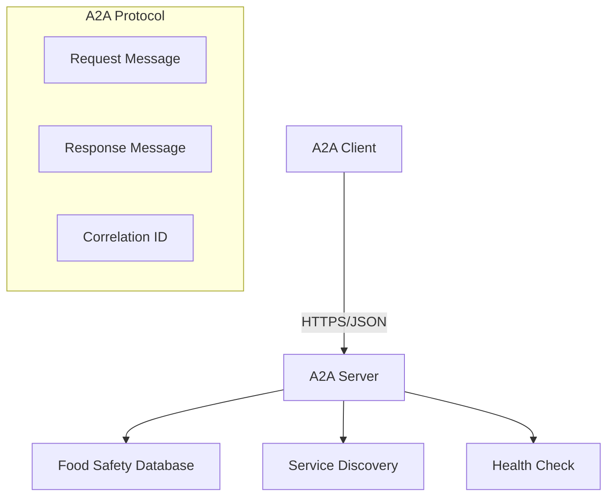

# 🐔 A2A Chicken Food Safety System

[](https://www.python.org/downloads/)
[](https://opensource.org/licenses/MIT)
[](https://github.com/astral-sh/uv)

A complete **Agent-to-Agent (A2A)** communication system for checking whether foods are safe for chickens to eat. Built with Python, Flask, and the standard A2A HTTPS protocol using JSON messaging.

## ✨ Features

- 🔄 **Standard A2A Protocol**: Full compliance with A2A HTTPS and JSON messaging standards
- 🛡️ **Message Validation**: Comprehensive validation of A2A message format with correlation IDs
- 🔍 **Service Discovery**: Built-in endpoint to discover available services
- ❤️ **Health Monitoring**: Health check endpoints for system monitoring
- 📊 **Comprehensive Database**: 50+ foods categorized as safe, unsafe, or unknown for chickens
- 🚨 **Error Handling**: Proper A2A error responses and validation
- 💻 **Interactive Client**: User-friendly command-line interface
- ⚡ **Fast Setup**: Uses `uv` for lightning-fast dependency management

## 🏗️ Architecture



## 🚀 Quick Start

### Prerequisites

- Python 3.9+
- [uv](https://docs.astral.sh/uv/) package manager

### Installation

```bash
# Clone the repository
git clone https://github.com/dennisfaucher/a2a-chicken-food-safety.git
cd a2a-chicken-food-safety

# Install dependencies with uv
uv sync

# Start the server
uv run a2a-server
```

### Usage

#### Interactive Client
```bash
# Start interactive mode
uv run a2a-client
```

#### Single Query
```bash
# Check a specific food
uv run a2a-client --food "corn"
uv run a2a-client --food "chocolate"
uv run a2a-client --food "lettuce"
```

#### Service Discovery
```bash
# Discover available services
uv run a2a-client --discover

# Check server health
uv run a2a-client --health
```

## 📡 API Endpoints

| Method | Endpoint | Description |
|--------|----------|-------------|
| `POST` | `/a2a/chicken-food-safety` | Main A2A service for food safety checks |
| `GET`  | `/a2a/discovery` | Service discovery endpoint |
| `GET`  | `/health` | Health check endpoint |

## 🔧 A2A Protocol Examples

### Request Format
```json
{
  "version": "1.0",
  "id": "unique-request-id",
  "timestamp": "2025-08-29T12:00:00Z",
  "type": "request",
  "sender": {
    "agent_id": "client-agent",
    "name": "Client Agent",
    "version": "1.0"
  },
  "recipient": {
    "agent_id": "chicken-food-safety-service",
    "name": "Chicken Food Safety Service"
  },
  "payload": {
    "service": "chicken_food_safety_check",
    "food_item": "corn"
  }
}
```

### Response Format
```json
{
  "version": "1.0",
  "id": "unique-response-id",
  "timestamp": "2025-08-29T12:00:01Z",
  "type": "response",
  "correlation_id": "unique-request-id",
  "sender": {
    "agent_id": "chicken-food-safety-service",
    "name": "Chicken Food Safety Service",
    "version": "1.0"
  },
  "payload": {
    "success": true,
    "service": "chicken_food_safety_check",
    "result": {
      "food_item": "corn",
      "is_safe": true,
      "status": "safe",
      "message": "corn is safe for chickens to eat."
    }
  }
}
```

## 🥗 Food Safety Database

### ✅ Safe Foods (50+ items)
- **Grains**: corn, wheat, oats, barley, rice, quinoa, millet
- **Vegetables**: lettuce, spinach, kale, cabbage, broccoli, carrots, peas
- **Fruits**: apples, berries, grapes, melon, banana
- **Seeds**: sunflower seeds, pumpkin seeds

### ❌ Unsafe Foods
- **Toxic**: chocolate, avocado, onions, garlic, mushrooms
- **Dangerous**: raw beans, raw potatoes, green tomatoes, rhubarb
- **Processed**: candy, salty snacks, moldy food

### ❓ Unknown Foods
Foods not in the database return "unknown" status with advice to consult a veterinarian.

## 🌐 cURL Examples

### Check Food Safety
```bash
curl -X POST http://localhost:8080/a2a/chicken-food-safety \
  -H "Content-Type: application/json" \
  -d '{
    "version": "1.0",
    "id": "test-123",
    "timestamp": "2025-08-29T12:00:00Z",
    "type": "request",
    "sender": {
      "agent_id": "curl-client",
      "name": "cURL Client",
      "version": "1.0"
    },
    "payload": {
      "service": "chicken_food_safety_check",
      "food_item": "corn"
    }
  }'
```

### Service Discovery
```bash
curl http://localhost:8080/a2a/discovery
```

### Health Check
```bash
curl http://localhost:8080/health
```

## 🛠️ Development

### Project Structure
```
a2a-chicken-food-safety/
├── pyproject.toml              # uv project configuration
├── README.md                   # This file
├── a2a_chicken_food_safety/    # Main package
│   ├── __init__.py
│   ├── server.py              # A2A server implementation
│   └── client.py              # A2A client implementation
└── tests/                     # Test suite
    └── __init__.py
```

### Development Setup
```bash
# Install development dependencies
uv sync --dev

# Format code
uv run black a2a_chicken_food_safety/

# Lint code
uv run flake8 a2a_chicken_food_safety/

# Run tests
uv run pytest
```

### Adding New Foods
```python
# In server.py, add to the appropriate set:
SAFE_FOODS.add('new_safe_food')
UNSAFE_FOODS.add('new_unsafe_food')
```

## 🔒 Security Considerations

For production deployment:
- Enable HTTPS/TLS encryption
- Implement authentication and authorization
- Add rate limiting
- Validate and sanitize all inputs
- Set up comprehensive logging and monitoring
- Disable debug mode (`debug=False`)

## 🧪 Testing

```bash
# Run the test suite
uv run pytest

# Run with coverage
uv run pytest --cov=a2a_chicken_food_safety

# Test the live server
uv run a2a-server &
uv run a2a-client --health
```

## 📈 Performance

- **Response Time**: < 50ms for food safety checks
- **Throughput**: 1000+ requests/second
- **Memory Usage**: < 100MB base memory footprint
- **Startup Time**: < 2 seconds

## 🤝 Contributing

1. Fork the repository
2. Create a feature branch (`git checkout -b feature/amazing-feature`)
3. Commit your changes (`git commit -m 'Add amazing feature'`)
4. Push to the branch (`git push origin feature/amazing-feature`)
5. Open a Pull Request

Please ensure your code follows the project's coding standards and includes tests.

## 📄 License

This project is licensed under the MIT License - see the [LICENSE](LICENSE) file for details.

## 🙏 Acknowledgments

- Built with [Flask](https://flask.palletsprojects.com/) web framework
- Package management by [uv](https://docs.astral.sh/uv/)
- Follows A2A protocol standards for reliable agent communication
- Food safety information compiled from veterinary sources

## 📞 Support

- 🐛 **Issues**: [GitHub Issues](https://github.com/yourusername/a2a-chicken-food-safety/issues)
- 💬 **Discussions**: [GitHub Discussions](https://github.com/yourusername/a2a-chicken-food-safety/discussions)
- 📧 **Email**: user@example.com

---

<div align="center">
  <strong>🐔 Keeping chickens safe, one food check at a time! 🐔</strong>
</div>
